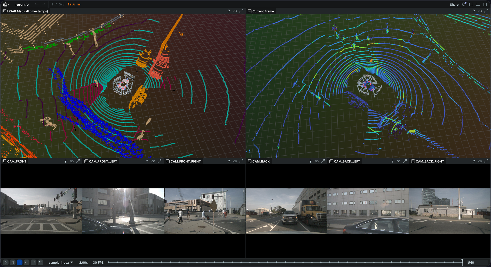
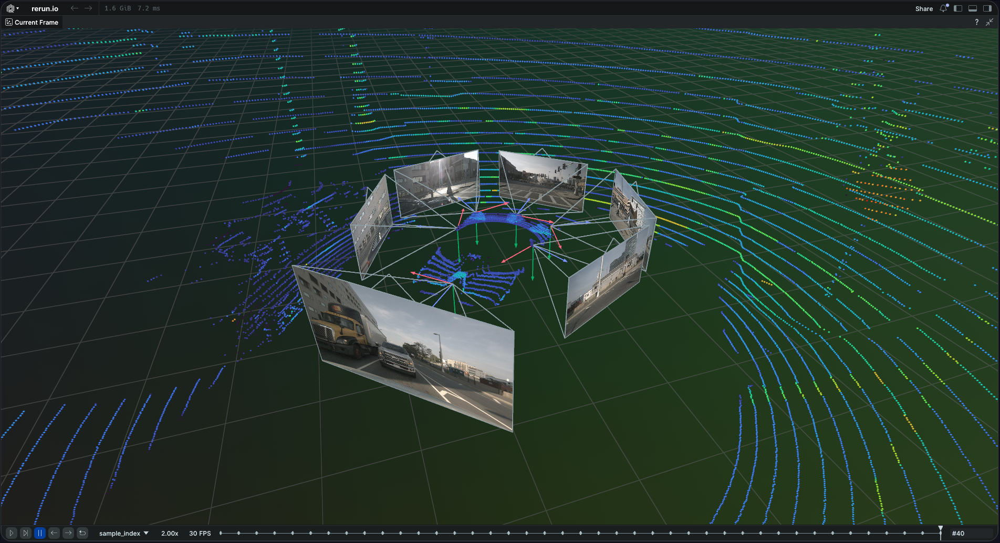
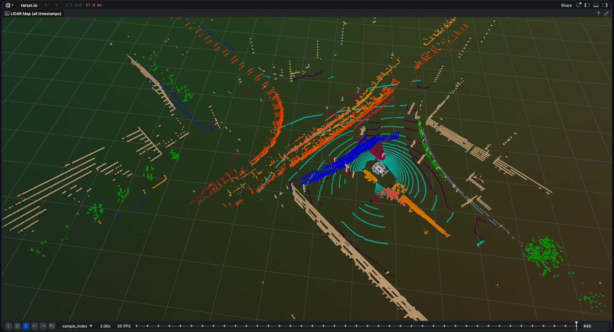

# Coordinate Transforms with nuScenes 🛰️

Visualize the 6 camera streams plus `LIDAR_TOP` from the nuScenes dataset in a fixed global frame using [Rerun](https://rerun.io/).

The goal of this exercise is to implement the **coordinate transformations** that relate:

- one sensor frame to another
- sensor frames to the ego vehicle frame
- sensor frames to the global frame

---

# Screenshots 📸

## Full Viewer Layout

<!-- TODO: Add screenshot -->




---

## Camera Frustums + LiDAR Alignment



---

<!--## Semantic Segmentation Map

-->


---

# Setup ⚙️

The nuScenes mini split should be placed in `./data`.

## Download Dataset

```bash
mkdir -p data
cd data

wget https://www.nuscenes.org/data/v1.0-mini.tgz
wget https://www.nuscenes.org/data/nuScenes-lidarseg-mini-v1.0.tar.bz2

tar -xvf v1.0-mini.tgz
tar -xvf nuScenes-lidarseg-mini-v1.0.tar.bz2
```

## Expected Directory Structure

```text
data
├── lidarseg
├── maps
├── nuScenes-lidarseg-mini-v1.0.tar.bz2
├── samples
├── sweeps
├── v1.0-mini
└── v1.0-mini.tgz
```

---

## Install Dependencies

```bash
uv sync
```

---

## Run the Viewer

```bash
uv run python src/coordinate_transforms/main.py --scene 0
```

This generates:

```text
output.rrd
```

Open it with:

```bash
rerun output.rrd
```

To open the live viewer directly instead of saving to file:

```bash
uv run python src/coordinate_transforms/main.py --scene 0 --viewer
```

---

# Rerun Viewer Layout 🖥️

## Top-Left 3D View

- Semantic-segmented accumulated LiDAR map
- Camera frustums
- Ego trajectory

## Top-Right 3D View

- Current LiDAR sweep
- Reflectance intensity coloring
- Camera frustums
- Ego trajectory

## Bottom Camera Strip

- 6 synchronized camera streams
- One view per sensor

Scrub the timeline or press play at 2 FPS to watch the vehicle move through the scene.

---

# Your Task: Implement 4 Functions 🧩

Complete the **4 functions** at the top of `src/coordinate_transforms/main.py`.

---

## Task 1 — `build_transform(R, t)`

Combine a 3×3 rotation matrix and a 3‑element translation vector into a 4×4 homogeneous matrix.

```python
def build_transform(R, t):
    """
    Parameters
    ----------
    R : ndarray
        Shape (3, 3). Rotation matrix.
    t : ndarray
        Shape (3,). Translation vector.

    Returns
    -------
    T : ndarray
        Shape (4, 4). Homogeneous transform matrix with R in the top-left
        3×3 block and t in the top-right 3×1 column. The bottom row is
        [0, 0, 0, 1].
    """
```

---

## Task 2 — `transform_points(T, points)`

Apply a 4×4 transform to a set of `(3, N)` points.

```python
def transform_points(T, points):
    """
    Parameters
    ----------
    T : ndarray
        Shape (4, 4). Homogeneous transform matrix.
    points : ndarray
        Shape (3, N). Point cloud in the source frame.

    Returns
    -------
    transformed : ndarray
        Shape (3, N). Point cloud in the target frame.
    """
```

---

## Task 3 — `transform_to_Rt(T)`

Decompose a 4×4 matrix back into rotation + translation (inverse of Task 1).

```python
def transform_to_Rt(T):
    """
    Parameters
    ----------
    T : ndarray
        Shape (4, 4). Homogeneous transform matrix.

    Returns
    -------
    R : ndarray
        Shape (3, 3). Rotation matrix.
    t : ndarray
        Shape (3,). Translation vector.
    """
```

---

## Task 4 — `sensor_to_global(nusc, sample_data_token)`

Build the 4×4 transform from a sensor frame to the global frame.

Each timestamp gives you two records that define the sensor's pose relative to the fixed global frame:

| Record | Maps | Provides |
|---|---|---|
| `calibrated_sensor` | sensor → ego vehicle | `rotation` (quaternion `[w,x,y,z]`), `translation` `[x,y,z]` |
| `ego_pose` | ego vehicle → global | `rotation` (quaternion `[w,x,y,z]`), `translation` `[x,y,z]` |

The provided helper `quaternion_to_rotation_matrix(q)` converts a quaternion to a 3×3 rotation matrix.

```python
def sensor_to_global(nusc, sample_data_token):
    """
    Parameters
    ----------
    nusc : NuScenes
        The loaded nuScenes dataset object.
    sample_data_token : str
        Token identifying one sensor reading at one timestamp.

    Returns
    -------
    T_sensor_global : ndarray
        Shape (4, 4). Homogeneous transform that maps a point in the
        sensor's local coordinate frame to the global coordinate frame.
    """
```

### Steps

1. Read the `calibrated_sensor` and `ego_pose` records from `nusc` using their tokens.
2. Convert each quaternion to a rotation matrix using `quaternion_to_rotation_matrix`.
3. Build a 4×4 `build_transform` for each (rotation, translation) pair.
4. Compose: `sensor_to_global = ego_to_global @ sensor_to_ego`.

---

## Key Idea 🌍

The global frame is fixed. Every sensor's pose is connected to it through the chain:

```
sensor → ego vehicle → global
```

You compose the two transforms by matrix multiplication.

# What Correct Output Looks Like ✅

When all 4 tasks are implemented correctly:

- LiDAR sweeps accumulate correctly over time
- Semantic segmentation colors match nuScenes labels
- Camera frustums align correctly with LiDAR points
- Ego trajectory traces the vehicle path
- All 6 camera streams update correctly per timestamp
- Sensor poses remain stable in the global frame


---

# References 📚

- nuScenes Tutorial Notebook  
  https://colab.research.google.com/github/nutonomy/nuscenes-devkit/blob/master/python-sdk/tutorials/nuscenes_tutorial.ipynb

- NumPy Crash Course  
  https://www.youtube.com/watch?v=QUT1VHiLmmI

---

# Lecture 3: Coordinate Transforms

**Presenter:** Aadith

## Topics Covered
- Rotation Matrices Representations
- Homogenous Coordinates
- SO(3) representation - Euler Angles, Quaternions
- Linear and Affine Transformations
